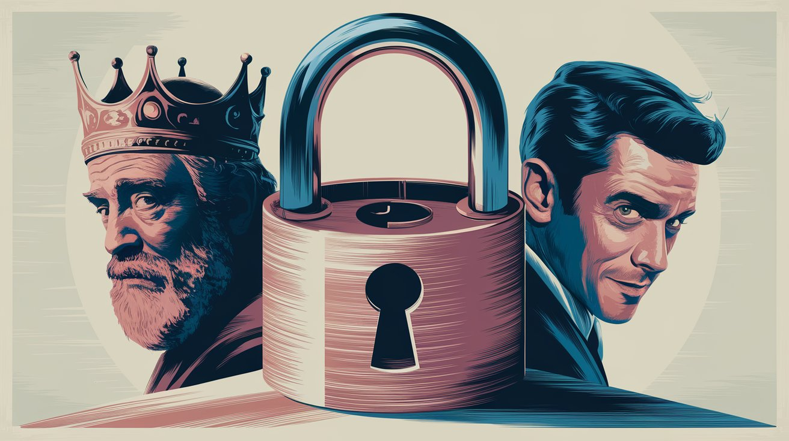

### Обращение к пьющему

Ты пришел в клуб и увидел людей, которые не пьют, работая по программе. Они тебе сказали, что надо вести дневники. Ты, конечно, посмеялся про себя: «Какие такие дневники мне, матерому пьянице! Да, я вам школьник, что ли, писать по ночам? Мне надо что-то более серьезное…» Каждый из нас хочет бросить по своему рецепту. Ну, и к чему тебя привели твои эксперименты? Снова пьянка и снова запой. Тебе же нужна `ТРЕЗВОСТЬ`, а ты видишь людей, которые не пьют более пяти и десяти лет. Тебе нужна трезвость, и тебе ее предлагают. А ты говоришь, что тебе такая трезвость не нужна, потому что надо что-то писать, а я так пить не брошу. У каждого из нас были такие мысли, и мы тоже не верили в это, но решили попробовать, попробуй и ты.

### Притча № 1. А ты наберись смелости, попробуй, сделай попытку!

«Дочку и полцарства в придачу! – сказал король, – тому, кто откроет самый сложный и тяжелый в нашем королевстве замок». Знатные вельможи, блистающие золотом и умом, вышли навстречу королю. Он подвел их к замку, на котором было более тысячи задвижек и отверстий. Мудрецы-вельможи стали разглядывать замок, но так и не прикоснувшись к нему признались, что они не могут открыть этот чудо-замок. «Если уж мудрецы не смогли открыть, – шептали другие придворные, – то где уж нам это сделать». И даже не осмелились подойти к загадочной груде железа. Все люди королевства потупили свой взор и только отрицательно качали головой. Лишь один добрый молодец подошел к замку, покачал его из стороны в сторону, и, наконец, взявшись за дужку, рывком открыл. Оказывается, замок не был даже защелкнут. Тогда царь, обратившись к принцессе, сказал: «Дочка, за этим человеком ты будешь, как за каменной стеной, потому что у него есть собственное мнение, и он набрался смелости и сделал попытку!»

# Дневник № 1.

### Оружие против России

> *Обращении 1700 врачей в Государственную Думу, в Совет Федерации, ко всем гражданам России*

Дорогие соотечественники!  
Дорогие братья и сестры!

Мы, врачи, профессора, академики медицины, обращаемся к вам с просьбой обсудить и вынести решение об официальном признании наркотиками алкоголя и табака, получивших массовое распространение в нашей стране, причинивших и причиняющих огромный вред человеку и обществу, ставящих под угрозу само существование нашего Отечества как культурного государства.

Все выдающиеся ученые мира, как прошлого, так и настоящего, бескомпромиссно установили, что алкоголь является сильным наркотическим ядом.

> 📖 [А. Н. Тимофеев](https://ru.wikipedia.org/wiki/%D0%A2%D0%B8%D0%BC%D0%BE%D1%84%D0%B5%D0%B5%D0%B2,_%D0%9D%D0%B8%D0%BA%D0%BE%D0%BB%D0%B0%D0%B9_%D0%9D%D0%B8%D0%BA%D0%BE%D0%BB%D0%B0%D0%B5%D0%B2%D0%B8%D1%87_(%D0%BF%D1%81%D0%B8%D1%85%D0%B8%D0%B0%D1%82%D1%80)) в книге «**Нервно-психические нарушения при алкогольной интоксикации**» (`Л., 1955 г.`) пишет:  
_«Алкоголь относится к наркотическим веществам жирного ряда, действующим парализующим образом на любую живую клетку… особенно на клетку коры головного мозга… оказывает парализующие действия на высшие отделы центральной нервной системы (ЦНС)… растормаживает механизмы нижележащих отделов. Этим объясняется возбужденное поведение человека, так как тормозной процесс в высших отделах уже постарадал»._

> 📑 [В. К. Федоров](https://ru.wikipedia.org/wiki/%D0%A4%D1%91%D0%B4%D0%BE%D1%80%D0%BE%D0%B2,_%D0%9B%D0%B5%D0%B2_%D0%9D%D0%B8%D0%BA%D0%BE%D0%BB%D0%B0%D0%B5%D0%B2%D0%B8%D1%87), ближайший ученик [И. П. Павлова](https://ru.wikipedia.org/wiki/%D0%9F%D0%B0%D0%B2%D0%BB%D0%BE%D0%B2,_%D0%98%D0%B2%D0%B0%D0%BD_%D0%9F%D0%B5%D1%82%D1%80%D0%BE%D0%B2%D0%B8%D1%87), в статье «**О начальном влиянии наркотиков (алкоголя и хлоралгидрата)**» утверждает, что  
_«…алкоголь есть наркотик, и как всякий наркотик, имеет свои особенности и лишь в деталях отличается от других наркотиков: все фазы влияния алкогля на ЦНС растянуты, …эйформия при алкоголе более отчетливая, чем и объясняется тяготение в человеческом обществе к алкоголю»_  
(«**Труды физиологической лаборатории И. П. Павлова**», `1949 г.`)

> 📖 [И. Н. Введенский](https://ru.wikipedia.org/wiki/%D0%92%D0%B2%D0%B5%D0%B4%D0%B5%D0%BD%D1%81%D0%BA%D0%B8%D0%B9,_%D0%98%D0%B2%D0%B0%D0%BD_%D0%9D%D0%B8%D0%BA%D0%BE%D0%BB%D0%B0%D0%B5%D0%B2%D0%B8%D1%87):  
_«Алкоголь относится к наркотическим ядам, из всех тканей тела имеет наибольшее сродство с ЦНС»_  
(«**[О вменяемости алкоголиков](https://primo.nlr.ru/primo-explore/fulldisplay?docid=07NLR_LMS007175073&context=L&vid=07NLR_VU1&lang=ru_RU&search_scope=default_scope&adaptor=Local%20Search%20Engine&tab=default_tab&query=lsr24,contains,%D0%BE%20%D0%B2%D0%BC%D0%B5%D0%BD%D1%8F%D0%B5%D0%BC%D0%BE%D1%81%D1%82%D0%B8%20%D0%B0%D0%BB%D0%BA%D0%BE%D0%B3%D0%BE%D0%BB%D0%B8%D0%BA%D0%BE%D0%B2&offset=0)**», `М., 1935 г.`)

> 📑 [Н. Е. Введенский](https://ru.wikipedia.org/wiki/%D0%92%D0%B2%D0%B5%D0%B4%D0%B5%D0%BD%D1%81%D0%BA%D0%B8%D0%B9,_%D0%9D%D0%B8%D0%BA%D0%BE%D0%BB%D0%B0%D0%B9_%D0%95%D0%B2%D0%B3%D0%B5%D0%BD%D1%8C%D0%B5%D0%B2%D0%B8%D1%87) пишет  
(**[Полное собрание сочинений, т. 7](https://primo.nlr.ru/primo-explore/fulldisplay?docid=07NLR_LMS008045574&context=L&vid=07NLR_VU1&lang=ru_RU&search_scope=default_scope&adaptor=Local%20Search%20Engine&tab=default_tab&query=lsr24,contains,%D0%B2%D0%B2%D0%B5%D0%B4%D0%B5%D0%BD%D1%81%D0%BA%D0%B8%D0%B9&facet=searchcreationdate,include,1950%7C,%7C1970&offset=0)**, `Л., 1963 г.`):  
_«Действие алкоголя во всех содержащих его спиртных напитках (водки, ликеры, вина, пиво и т. д.) на организм сходно с действием наркотических веществ и типичных ядов (таких, как хлороформ, эфир, опий и т. д.)»_

